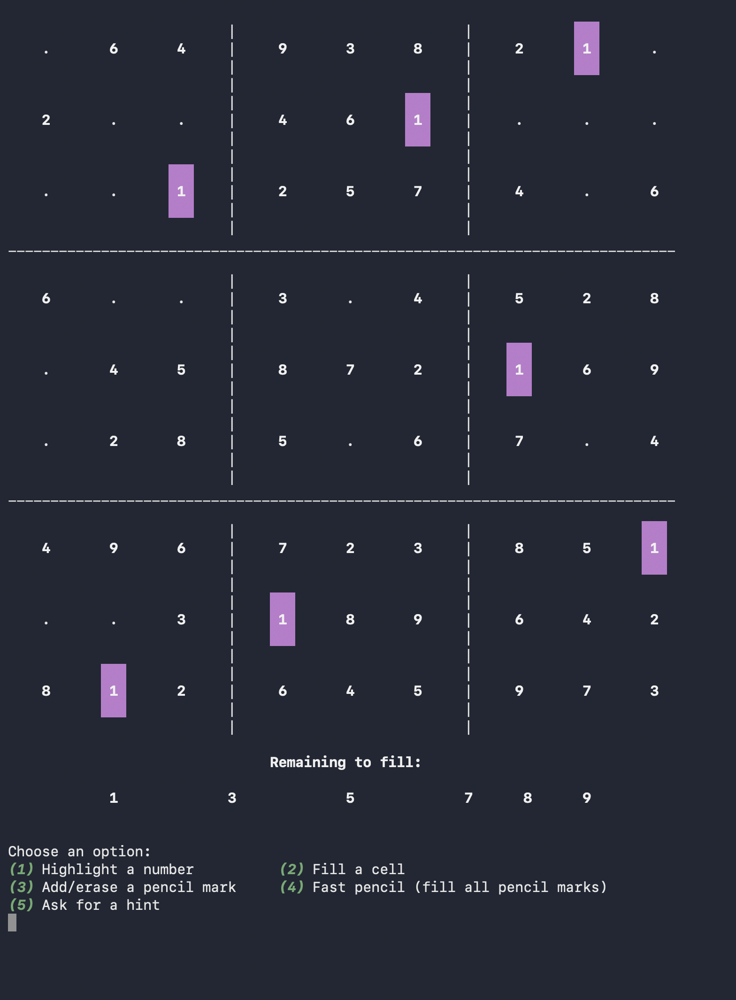
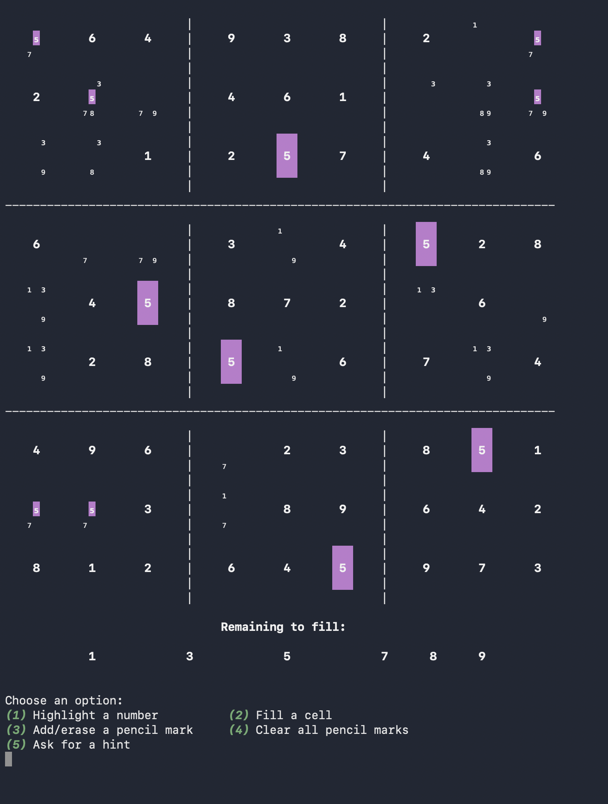

# Terminal Sudoku

A fully-featured Sudoku game written in C, playable in the terminal on Windows, Mac, and Linux.

## About This Project

I started learning to code three months ago, and this Sudoku game is my first personal project. It is still in the early stages of development with several features planned but not yet implemented.

The current version is a terminal-based C program. The long-term goal is to rebuild it in Swift and SwiftUI as a fully shippable iOS app on the App Store.

## Screenshots

**Standard view with highlighting**



**Pencil marks view**



## Features

- **Highlighting** — select any number to highlight all its occurrences on the board
- **Pencil marks** — manually add candidate numbers to empty cells
- **Fast pencil** — automatically fill all empty cells with valid candidate numbers
- **Hints** — ask for a hint when you're stuck (last cell technique currently implemented)
- **Mistake tracking** — the game tracks how many wrong numbers you've entered (different from invalid moves)
- **Auto-highlight** — when all cells of a number are filled, automatically highlights the next incomplete number
- **Solver** — built-in backtracking solver used to verify your answers

## How to Play

**Controls**

| Option | Action |
|--------|--------|
| 1 | Highlight a number |
| 2 | Fill a cell |
| 3 | Add/erase a pencil mark |
| 4 | Fast pencil / Clear all pencil marks |
| 5 | Ask for a hint |
| 0 | Go back to previous menu |

**Filling a cell**
1. Select option 2
2. Enter the row (1-9)
3. Enter the column (1-9)
4. Enter the number (1-9)

The game will tell you if the move is invalid, wrong, or correct.

## Building and Running

**Mac / Linux**
```bash
gcc sudoku.c -o sudoku
./sudoku
```

**Windows (MinGW)**
```bash
gcc sudoku.c -o sudoku.exe
sudoku.exe
```

## Puzzle Files

Puzzles are loaded from `.txt` files where `0` represents an empty cell:

```
5 3 0 0 7 0 0 0 0
6 0 0 1 9 5 0 0 0
0 9 8 0 0 0 0 6 0
8 0 0 0 6 0 0 0 3
4 0 0 8 0 3 0 0 1
7 0 0 0 2 0 0 0 6
0 6 0 0 0 0 2 8 0
0 0 0 4 1 9 0 0 5
0 0 0 0 8 0 0 7 9
```

## Known Limitations

- Puzzles are loaded from external `.txt` files included with the game
- Unique puzzle generation is not yet implemented and will be added in a future update
- To add your own puzzles, create a `.txt` file with 81 numbers (0 for empty cells) separated by spaces
- Hints currently only implement the Last Cell technique — more techniques coming soon

## Planned Features

- Puzzle generation with difficulty levels
- Undo button
- More hint techniques (naked singles/pairs/triples, hidden singles/pairs/triples, X-wing/XY-wing, skyscrapers, swordfish, unique rectangle, BUG+1, etc)

